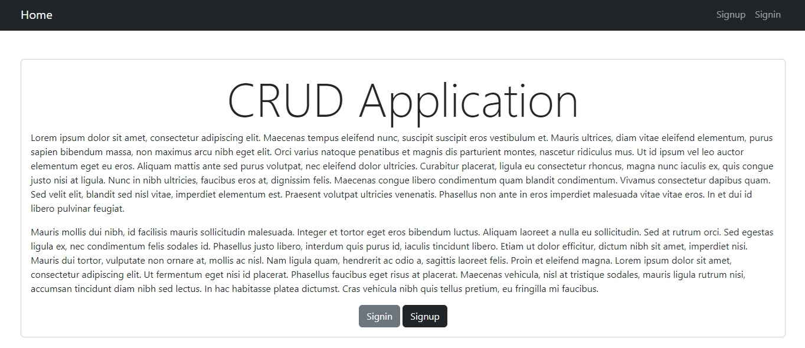

# Management Tasks

Este proyecto es una aplicación web desarrollada con Django y Bootstrap, diseñada para gestionar tareas con funcionalidades completas de operaciones `CRUD`, autenticación de usuario y protección de rutas. Está diseñado para usuarios que necesitan iniciar sesión para acceder a sus funcionalidades.

> [!NOTE]
> Esta versión ha sido refactorizada para incorporar conceptos avanzados y nuevas prácticas aprendidas en `Django`.

## 🛠️ Tecnologias utilizadas
- **Django**: Framework de desarrollo web de alto nivel que promueve un desarrollo rápido y un diseño limpio y pragmático.
- **Bootstrap**: Framework de CSS que facilita el desarrollo de componentes y diseños responsivos.
- **SQLite**: Sistema de gestión de bases de datos utilizado para el almacenamiento de datos (configurable para usar otras bases de datos).

## 📂 Estructura del proyecto
El proyecto se organiza de la siguiente manera:
```
├── djangocrud
│   ├── asgi.py 
│   ├── settings.py 
│   ├── urls.py 
│   └── wsgi.py 
├── tasks
│   ├── migrations/...
│   ├── static/...
│   ├── templates/...
│   ├── admin.py 
│   ├── app.py 
│   ├── forms.py 
│   ├── models.py
│   ├── test.py 
│   └── views.py
├── .gitignore
├── LICENSE
├── README.md
├── db.sqlite3
├── manage.py
└── requierments.txt
```

## 🔧 Configuración del Entorno Virtual
Para configurar el entorno de desarrollo:
1. Instala `virtualenv` si aún no está instalado:
```
pip install virtualenv
```
2. Crea el entorno virtual:
```
python -m virtualenv venv
```
3. Activa el entorno virtual:
```
venv\Scripts\activate
```

> [!TIP]
> Se recomienda utilizar un entorno virtual optimiza el desarrollo y la ejecución del proyecto.

## 🧾 Instalación de dependencias
Instala las dependencias listadas en `requirements.txt` con el comando:
```
pip install -r requirements.txt
```

## 📚 Recursos adicionales
* [Documentación de Django](https://docs.djangoproject.com/en/5.1/)
* [Documentación de Bootstrap](https://getbootstrap.com/docs/4.1/getting-started/introduction/)

## 📝 Contribuciones
Las contribuciones son bienvenidas. Para contribuir:
1. Haz un `fork` del repositorio.
2. Crea una rama para tus mejoras.
3. Envía un `pull request`.

## 📄 Licencia
Este proyecto está licenciado bajo la licencia `MIT`. Consulta el archivo `LICENSE` para más detalles.
