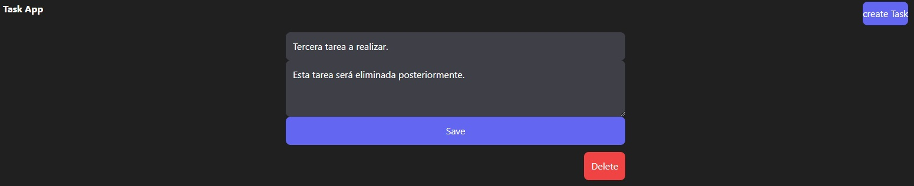
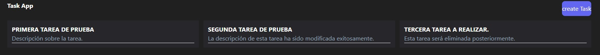

# Management Tasks - Django and React + Vite

Este proyecto es una aplicación web desarrollada para permitir a los usuarios realizar operaciones básicas de gestión de tareas.

> [!IMPORTANT]
Este proyecto es de caracter educativo y sirve para entender conceptos basicos relacionados a las REST API, asi como comenzar a realizar estudios sobre los Framework de Django, React y la aplicacion de SGBD en la integracion de una aplicaciones WEB. Se recomienda a quien vaya a usar este proyecto de estudio lease el fichero NOTE.txt ya que puede servir de ayuda.

## Tecnologías Utilizadas
1. Backend: Django.
2. Frontend: React + Vite.
3. Base de Datos: SQLite (no excluyente).

> [!NOTE]
Sera necesario la creacion tanto de la BBDD con la relacion de la misma con este proyecto para poder obtener la funcionalidad del mismo de manera optima. Se sugiere la seleccion de una BBDD SQLite aunque no es excluyente, pudiendo escoger cualquier otra BBDD relacional para el uso de este proyecto.

## Funcionalidad
1. Registro de tareas
2. Edición de tareas existentes
3. Eliminación de tareas

## Creacion del entorno de virtual:
python -m virtualenv nombreEntorno

> [!TIP]
Se recomienda la creación de un entorno virtual para optimizar el desarrollo y la ejecución del proyecto.

## Dependencias
pip freeze > requirements.txt  
pip install -r requirements.txt

## Contribuciones
Las contribuciones son bienvenidas. Si deseas contribuir al proyecto, por favor haz un 'fork' del repositorio, crea una rama con tus mejoras y envía un 'pull request'.

## Licencia
Este proyecto está bajo una licencia MIT. Consulta el archivo LICENSE para más detalles.
